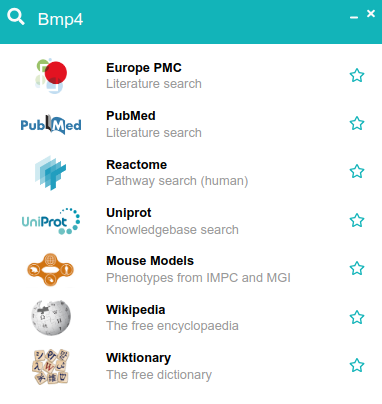
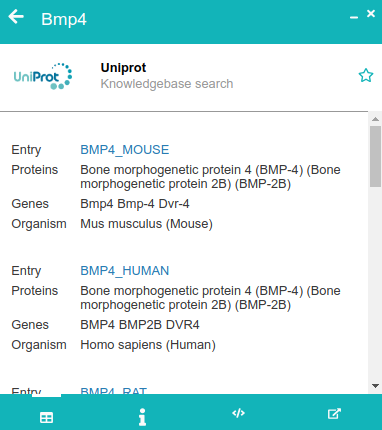

# FAIR-biomed

Browser extension for accessing open data resources in the biomedical domain. 

## Introduction

Vasts amounts of biomedical data are stored in open databases and knowledge-bases. Data in these resources are intended to be findable, accessible, interoperable, and reusable ([FAIR](https://www.nature.com/articles/sdata201618)). However, the data is distributed across many resources and integrating relevant parts within a specific project can be a challenge.

FAIR-biomed is a browser extension (for chrome) that brings open data resources directly to specific research situations. Consider, for example, reading a report in your browser. With FAIR-biomed, you can access additional information on any part of the report without leaving the page.

To make use of the extension, first highlight some text, for example, a gene name. Press `Ctr+Shift+Z` on the keyboard (alternatively `right-click > FAIR-biomed search` with the mouse). A new box should appear prompting you to choose a data source to query. 

Clicking on one of the options triggers a query to the corresponding data service and displays a summary of results.

Search results provide summaries of the data resource, details of how the data query was executed, and a link to further data.

## Data sources

The FAIR-biomed app is composed of core components and a library of plugins. Each of the plugins provides access to a data resource and a specific query type.

The current plugin library provides access to a small but varied set of data sources.

| Data source      | Plugins      |
| :----- | :----- |
| [ClinGen](https://www.clinicalgenome.org/) | Allele registry |
| [EBI](https://www.ebi.ac.uk/) | Identifiers, ontology, GWAS, and chemical data |
| [Europe PMC](https://www.europepmc.org) | Literature | 
| [ExAC](http://exac.broadinstitute.org/) | Genomic variant annotation |
| [IMPC](https://www.mousephenotype.org) | Mouse model phenotypes |
| [NCBI](https://www.ncbi.nlm.nih.gov/) | Literature, gene summaries |
| [Reactome](https://www.reactome.org/) | Pathways |
| [Uniprot](https://www.uniprot.org/) | Knowledgebase |
| [Wikimedia](https://www.wikimedia.org/) | Encyclopaedia and dictionary |

## Practical Issues

### Installation

The extension is available from the chrome [web store](https://chrome.google.com/webstore/detail/fair-biomed/kaacnnmpcdbebmkbcddpckgpgphhcdhn). Select the extension in the web store, click `Add to chrome`, and read any information boxes. Once installed, highlight text on a web page and press `Ctrl+Shift+Z` to perform searches.   

To install the FAIR-biomed extension manually using code from this repository, see the [develper's documentation](docs/install.md)

### Local URLs

The extension is automatically active on all pages that you accesss via urls starting with 'http' or 'https'. You can also use the extension with reports stored on your own computer, but this functionality is disabled by default by the chrome browser. To use this feature, you must enable it manually.
 
 - Select `Tools > Extensions` from the chrome menus; a new tab should appear listing all your installed extensions
 - Find `FAIR-biomed` and click `Details`; the view should change and display more details on the extension
 - Scroll down to the setting `Allow access to file URLs` and turn on the switch.

### Options

The extension has a dedicated page where you tune which data sources you would like displayed in the popups. 

 - Select `Tools > Extensions` from the chrome menu.
 - Find `FAIR-biomed` in the list of installed extensions and click `Details`.
 - Scroll down to the setting `Extension options` and click on the link.
 - On the page that appears, use the switches to turn individual plugins on or off. Use the rating systems to mark which plugins you find most useful.  
 
 
### Privacy

Once installed, the extension records a small amount of information on each user's computer. This data pertains to which plugins are active (see previous section on Options) and how each plugin is rated.

The extension does not record users' activity. In particular, the extension does not record performed searches. Note, however, that the extension sends queries to external APIs. Some of these services may record activity for their own purposes (for example, to demonstrate their relevance to the science community). See the privacy policies of those services for details.

When installing the extension from the chrome web store, google collects some user information. See their [privacy policy](https://policies.google.com/privacy?hl=en-GB) for details.  

## Get involved

Feedback and contributions are welcome. Please raise an issue in the github repository.

To incorporate a new data resource or plugin, see the [documentation](docs/).

## Notes and References

The idea of augmenting web pages with additional information has a long history. 

 - [Reflect](https://scholar.google.co.uk/scholar?hl=en&as_sdt=0%2C5&q=Reflect%3A+augmented+browsing+for+the+life+scientist&btnG=) was an early implementation of a browser extension aimed at biomedical research. This extension sent a whole web-page to a server for annotation.
 
 - [Dynamic linking](https://ieeexplore.ieee.org/document/4510879) outlined an idea to infer links to specialist sources by scanning the context of web pages.  

The implementation of FAIR-biomed relies on a number of technologies and compoenents.

 - [Fontawesome](https://fontawesome.com/icons) - Icons used in the app come from the free set of the Fontawesome collection. 

 - Third-party libraries. This browser uses several third-party libraries. These are listed in file `package.json`. 
